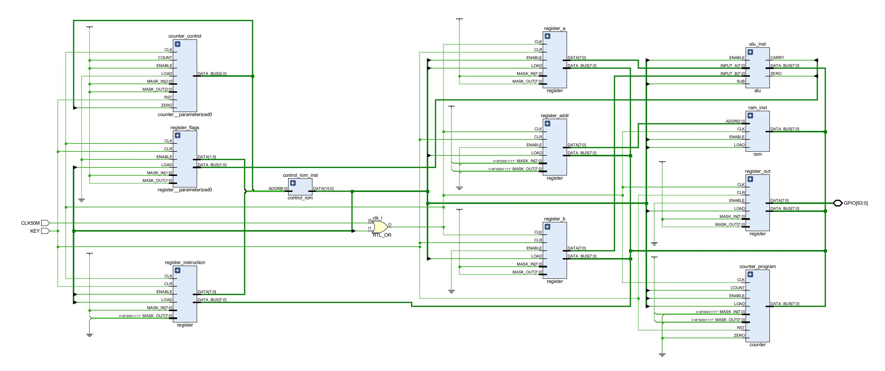

# Ben Eater's 8-bit Breadboard Computer

Implemented to be as accurate as possible. Tested on [A7 Minima](https://github.com/crls-design/A7-Minima). Each module is designed just like on the [series](https://www.youtube.com/playlist?list=PLowKtXNTBypGqImE405J2565dvjafglHU).

## Key Differences

- Active high logic
- Control signals ROM is implemented using LUT
- Data mask is used instead of 4-bit connection to the bus (PC, RAM address, instruction)
- Halt is implemented by forcing clock high
- Program is loaded using `.coe` file and cannot be modified after synthesis

## Example Programs

As featured on the series.

- [Count Up and Down](./Ben-8-Bit.srcs/sources_1/new/count_up_down.coe)
- [Multiply](./Ben-8-Bit.srcs/sources_1/new/multiply.coe)
